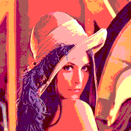
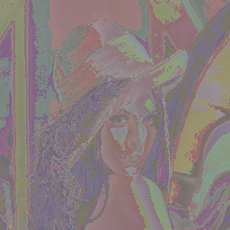
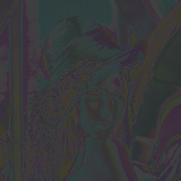
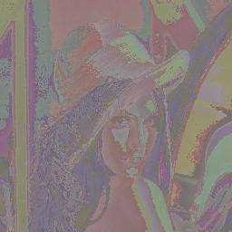

# [stb-image-metrics](https://github.com/ImageProcessing-ElectronicPublications/stb-image-metrics) demo

This utility compares two graphics files based on metrics.

Demo of [stb-image-metrics](https://github.com/ImageProcessing-ElectronicPublications/stb-image-metrics).

## Metrics

Origin and Compare:

 

Metrcics:

```shell
stbimmetrics lena.png lena.quant444.png lena.quant444.psnr.png 
Load: lena.png
image: 256x256:3
Load: lena.quant444.png
image: 256x256:3
type: psnr
metric: 18.663233
Save png: lena.quant444.psnr.png

```

---

RGB mode:

*  MSE: 0.013604
*  PSNR: 18.663233
*  SMALLFRY: 83.753342
*  SHARPENBAD: -0.213132
*  Corelation: 0.953666
*  NHW-N: 0.072673
*  NHW-C: 0.145290
*  NHW-R: 0.116387

---

YCbCr mode:

*  MSE: 0.006030
*  PSNR: 22.196735
*  SMALLFRY: 85.867256
*  SHARPENBAD: -0.242864
*  Corelation: 0.951516
*  NHW-N: 0.075381
*  NHW-C: 0.091878
*  NHW-R: 0.078292


---

---
