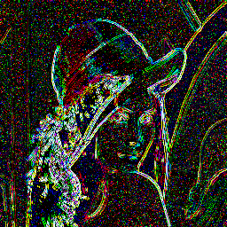

# [stb-image-metrics](https://github.com/ImageProcessing-ElectronicPublications/stb-image-metrics) demo

This utility compares two graphics files based on metrics.

Demo of [stb-image-metrics](https://github.com/ImageProcessing-ElectronicPublications/stb-image-metrics).

## Metrics

Origin and Compare:

 

Metrcics:

```shell
stbimmetrics lena.png lena.quant444.png lena.quant444.psnr.png 
Load: lena.png
image: 256x256:3
Load: lena.quant444.png
image: 256x256:3
type: psnr
metric: 18.663233
Save png: lena.quant444.psnr.png

```

---

RGB mode:

| Name | Image metric | Value | UM |
| --- | --- | --- | --- |
| MSE |  | 0.013604 | 0.208771 |
| PSNR |  | 18.663233 | 0.470890 |
| SDSNR |  | 13.888971 | 0.454668 |
| Corelation |  | 0.953666 | 0.285007 |
| SSIM |  | 0.618509 | 0.050606 |
| VIFP1 |  | 0.170903 | 0.053111 |
| SMALLFRY |  | 83.753342 | 0.341786 |
| SHARPENBAD |  | 0.389942 | 0.138531 |
| NHW-C |  | 0.145290 | 0.422748 |
| NHW-N |  | 0.072673 | 0.550836 |
| NHW-R |  | 0.116387 | 0.381794 |

---

YCbCr mode:

| Name | Image metric | Value | UM |
| --- | --- | --- | --- |
| MSE |  | 0.006030 | 0.255863 |
| PSNR |  | 22.196735 | 0.513536 |
| SDSNR |  | 21.873943 | 0.507061 |
| Corelation |  | 0.951516 | 0.278486 |
| SSIM |  | 0.608033 | 0.046795 |
| VIFP1 |  | 0.227644 | 0.094781 |
| SMALLFRY |  | 85.867256 | 0.385938 |
| SHARPENBAD |  | 0.371371 | 0.125152 |
| NHW-C |  | 0.091878 | 0.474065 |
| NHW-N |  | 0.075381 | 0.545821 |
| NHW-R |  | 0.078292 | 0.421576 |

---

---
