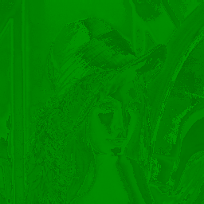

# [stb-image-metrics](https://github.com/ImageProcessing-ElectronicPublications/stb-image-metrics) demo

This utility compares two graphics files based on metrics.

Demo of [stb-image-metrics](https://github.com/ImageProcessing-ElectronicPublications/stb-image-metrics).

## Metrics

Origin and Compare:

 

Metrcics:

```shell
stbimmetrics lena.png lena.quant444.png lena.quant444.psnr.png 
Load: lena.png
image: 256x256:3
Load: lena.quant444.png
image: 256x256:3
type: psnr
metric: 18.663233
Save png: lena.quant444.psnr.png

```

---

RGB mode:

*  MSE: 0.013604, UM: -1.218735
*  PSNR: 18.663233, UM: -1.317894
*  SMALLFRY: 83.753342, UM -0.653625
*  SHARPENBAD: -0.213132, UM: -0.575435
*  Corelation: 0.953666, UM: -0.644979
*  NHW-N: 0.072673, UM: 0.144120
*  NHW-C: 0.145290, UM: -0.042954
*  NHW-R: 0.116387, UM: -0.109872

---

YCbCr mode:

*  MSE: 0.006030, UM: 0.422970
*  PSNR: 22.196735, UM: -0.887525
*  SMALLFRY: 85.867256, UM: -0.495716
*  SHARPENBAD: -0.242864, UM: -0.619439
*  Corelation: 0.951516, UM: -0.664542
*  NHW-N: 0.075381, UM: 0.133249
*  NHW-C: 0.091878, UM: 0.067151
*  NHW-R: 0.078292, UM: -0.004621


---

---
